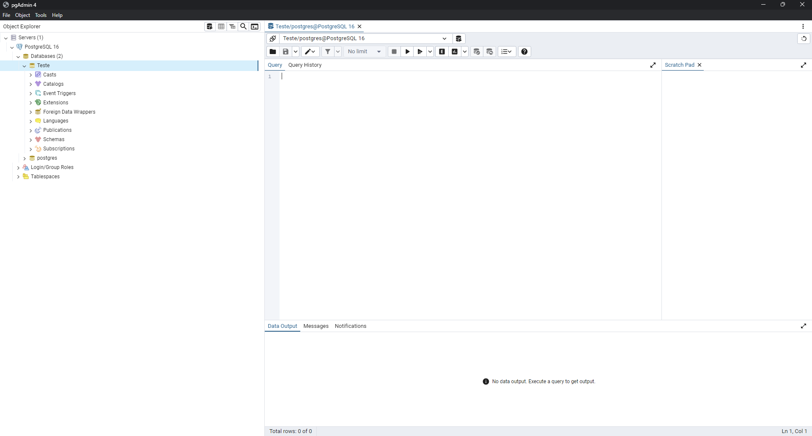

# PostGIS


Parte teórica da Apresentação do PostGIS

## Pré-requesitos

O que você precisa ter instalado:

```
PostgreSQL
```

## Passo 1 - Instalação

Com a instalação do PostgreSQL concluída, o próximo passo é instalar o PostGIS.

Primeiro, você procura a aplicação **Application Stack Builder**.  


Após isso, você seleciona a versão do PostgreSQL que estará utilizando.


Em seguida, selecione a aplicação PostGIS.


Agora, escolha a pasta onde a aplicação será armazenada.


Para proceder com a instalação, desmarque a caixa de seleção e clique em "NEXT".


Depois, basta clicar em "NEXT" em todas as caixas que aparecerem.


<br><br>

## Vinculando a extensão PostGIS a um Banco de Dados



Abra o PgAdmin e selecione o banco de dados no qual deseja instalar o PostGIS. Em seguida, execute a ferramenta de consulta.


Para instalar a extensão no banco de dados, execute o seguinte comando:

```
CREATE EXTENSION postgis;
CREATE EXTENSION postgis_topology;
```
<br>
## Criando uma tabela com suporte a dados geometry