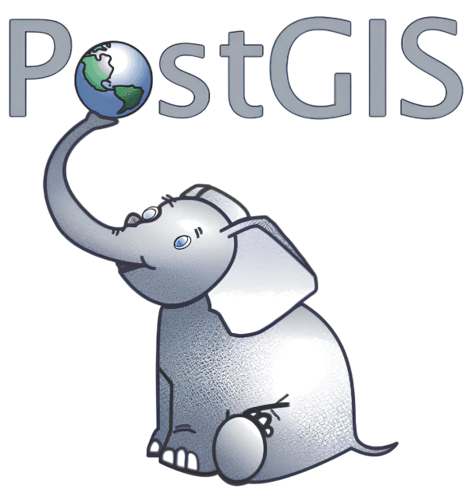
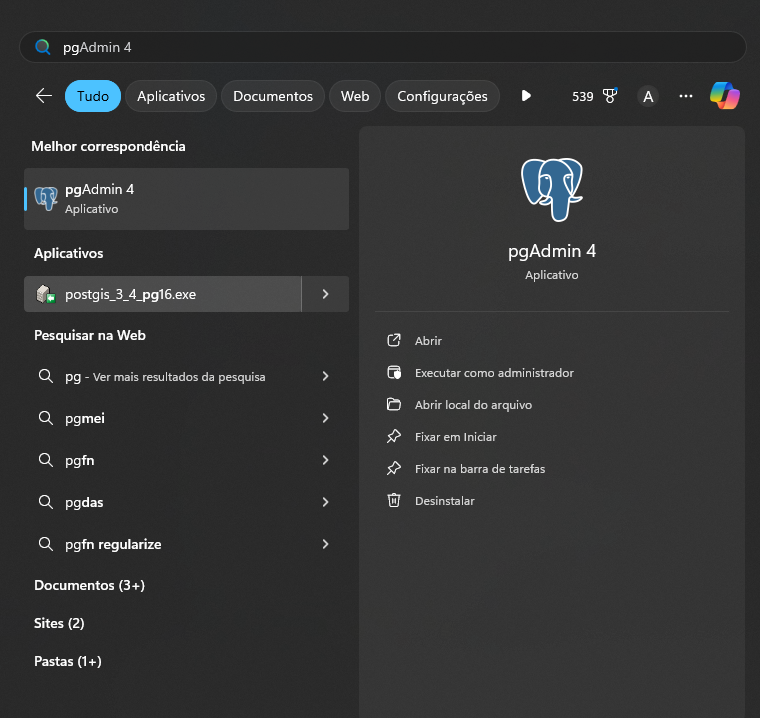
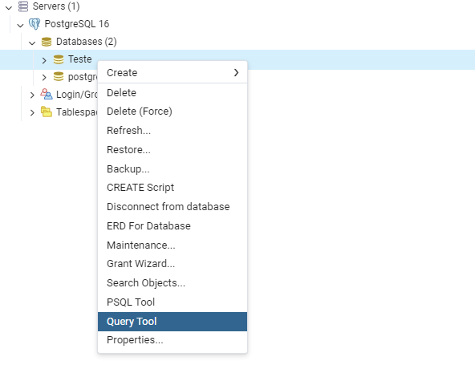
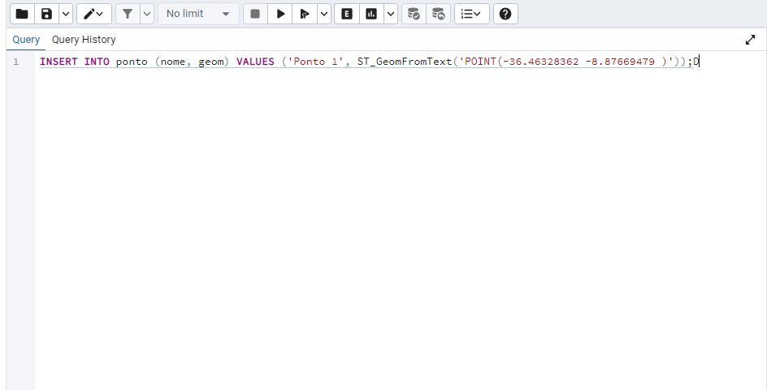
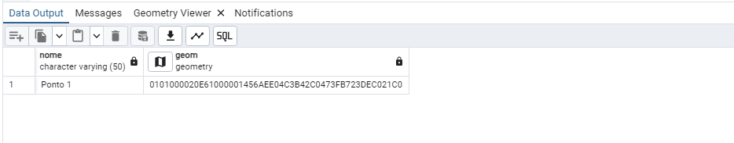
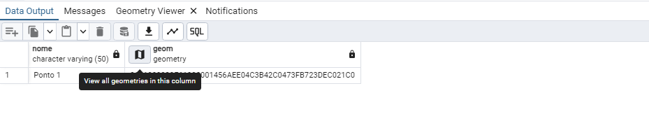
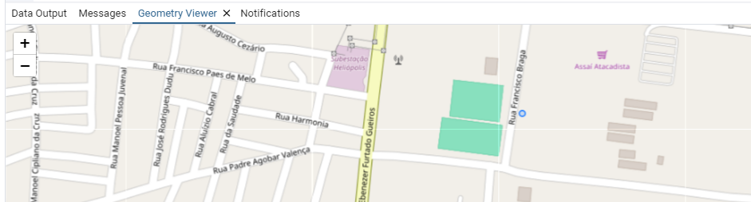
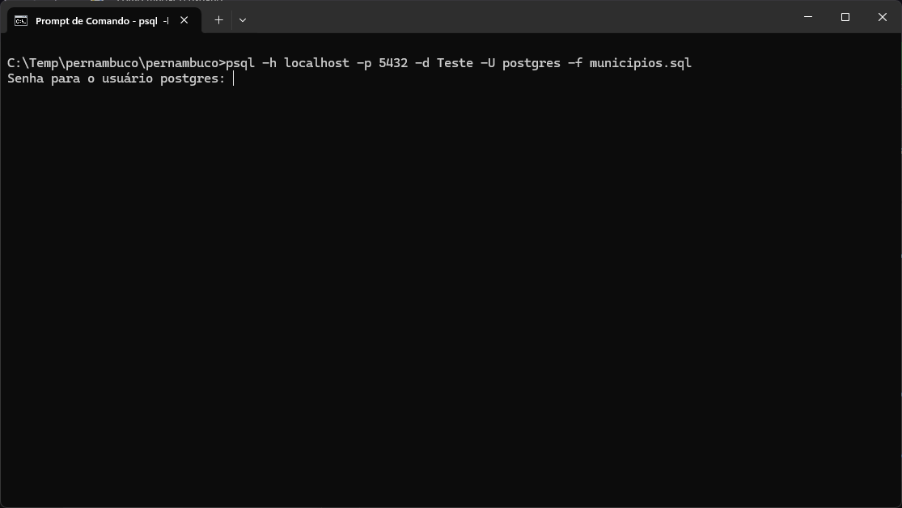
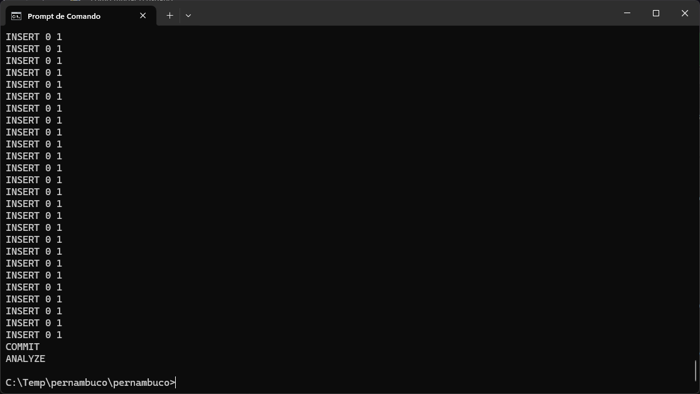

# PostGIS



Parte teórica da Apresentação do PostGIS

## Pré-requesitos

O que você precisa ter instalado:

```
PostgreSQL
```

## Instalação do PostGIS

Após concluir a instalação do PostgreSQL, o próximo passo é instalar a extensão PostGIS, que permite trabalhar com dados geoespaciais de forma eficiente.

### Abrindo o Application Stack Builder

Para iniciar a instalação do PostGIS, abra a aplicação **Application Stack Builder**, que geralmente é instalada junto com o PostgreSQL. Este utilitário facilita a instalação de componentes adicionais.


### Selecionando a Versão do PostgreSQL

Na interface do **Application Stack Builder**, você será solicitado a selecionar a versão do PostgreSQL que está instalada em seu sistema. Certifique-se de escolher a versão correta para garantir a compatibilidade com o PostGIS.


### Selecionando a Aplicação PostGIS

Depois de selecionar a versão do PostgreSQL, uma lista de aplicações disponíveis será exibida. Marque a caixa correspondente ao PostGIS e clique em **NEXT** para prosseguir com a instalação.


### Escolhendo o Diretório de Instalação

Em seguida, você será solicitado a escolher o diretório onde o PostGIS será instalado. É recomendável usar o diretório padrão a menos que você tenha uma razão específica para alterá-lo. Após selecionar o diretório, clique em **NEXT**.


### Configurando a Instalação

Para avançar na instalação, desmarque a caixa de seleção que pode aparecer e clique em **NEXT**.


### Finalizando a Instalação

Continue clicando em **NEXT** nas telas subsequentes até que a instalação esteja concluída. O assistente de instalação guiará você por cada etapa, e a instalação do PostGIS pode levar alguns minutos, dependendo da sua máquina.


<br><br>

## Vinculando a extensão PostGIS a um Banco de Dados

Após a instalação bem-sucedida do PostGIS, o próximo passo é vincular a extensão ao banco de dados em que você deseja trabalhar. Isso permitirá que você utilize as funcionalidades geoespaciais fornecidas pelo PostGIS.

### Abrindo o PgAdmin

Inicie o PgAdmin, a interface gráfica de administração para PostgreSQL. Esta ferramenta facilita a gestão de bancos de dados e é essencial para a vinculação de extensões.



### Selecionando o Banco de Dados

Na árvore de objetos à esquerda, expanda a lista de servidores e localize o banco de dados que você deseja usar com o PostGIS. Clique com o botão direito no nome do banco de dados e selecione `Query Tool` (Ferramenta de Consulta) para abrir um editor de SQL.



### Executando os Comandos de Instalação da Extensão

No editor de SQL, insira os seguintes comandos para instalar as extensões do PostGIS e do Topology:
```
CREATE EXTENSION postgis;
CREATE EXTENSION postgis_topology;
```
Esses comandos adicionam as funcionalidades geoespaciais ao seu banco de dados, permitindo que você armazene e manipule dados geográficos.


<br>

## Criando uma tabela PONTO com suporte a dados geometry

Com o PostGIS instalado, poderemos finalmente criar uma tabela com suporte a dados **geometry**

### Adicionando Coluna com Suporte a Dados Geoespaciais

Para armazenar dados do tipo `geometry` em uma tabela, é necessário criar uma coluna que ofereça suporte a esse tipo de dado. No exemplo a seguir, criamos uma tabela chamada `ponto` que inclui uma coluna `geom` para armazenar geometrias do tipo `POINT` com o sistema de coordenadas EPSG:4326.

```
CREATE TABLE ponto(
	nome VARCHAR(50),
	geom geometry(POINT, 4326)
);
```


### Inserindo Dados na Tabela

Após a criação da tabela, podemos proceder com a inserção de dados. Para adicionar informações utilizando o formato Well-Known Text (WKT), utilizamos a função `ST_GeomFromText`. Essa função permite converter uma representação de texto de uma geometria em um objeto de geometria que pode ser armazenado na tabela.

```
INSERT INTO ponto (nome, geom) VALUES ('Ponto 1', ST_GeomFromText('POINT(-36.46328362 -8.87669479 )'));
```



### Consultando os Dados na Tabela

Para consultar os dados armazenados na tabela, utilizamos o seguinte comando SQL:

```
SELECT * FROM ponto;
```

Esse comando retorna todos os registros da tabela `ponto`, permitindo que você visualize todas as informações inseridas.



### Visualizando o Ponto em um Mapa

Para visualizar os dados em um mapa, clique no ícone ao lado da coluna geom. Essa ação abrirá uma representação geográfica do ponto armazenado, permitindo uma melhor compreensão da sua localização.



Logo ápos abrirá um mapa com localização dos pontos



## Utilizando dados Shapefile no PostGIS

Graças à conformidade com os padrões da OGC (Open Geospatial Consortium), é possível integrar diretamente os dados de um arquivo Shapefile no PostGIS. Isso facilita a inclusão de informações geoespaciais em seu banco de dados, permitindo que você aproveite as funcionalidades avançadas que o PostGIS oferece.

### Modificando a variável de ambiente PATH no Windows

Para configurar o ambiente corretamente, localize a pasta `bin` do PostgreSQL e execute o seguinte comando no CMD do Windows:

```
set PATH=%PATH%;C:\Program Files\PostgreSQL\<sua_versao>\bin
```

Se a versão do PostgreSQL instalada em sua máquina for diferente da mencionada, certifique-se de substituir `<sua_versao>` pela versão correta que você está utilizando. Isso garantirá que você tenha acesso às ferramentas do PostgreSQL a partir do terminal.

### Convertendo Shapefile em SQL

Para utilizar dados de um arquivo Shapefile em um banco de dados PostgreSQL com a extensão PostGIS, é necessário converter o arquivo Shapefile (.shp) em instruções SQL. Siga os passos abaixo para realizar essa conversão.

#### Passo 1: Preparação do Arquivo Shapefile

1. Download do Arquivo: Certifique-se de que o arquivo Shapefile já esteja baixado em sua máquina. Caso ainda não tenha, você pode obtê-lo no site do IBGE.

2. Organização dos Arquivos: Mova todos os arquivos relacionados ao Shapefile para uma pasta específica. O Shapefile geralmente consiste em vários arquivos com extensões como `.shp`, `.shx`, `.dbf`, entre outros.

#### Passo 2: Acessando o Terminal

Abra o terminal (CMD) do Windows e navegue até a pasta onde os arquivos do Shapefile estão localizados.

#### Passo 3: Executando o Comando de Conversão

Utilize o seguinte comando para converter o arquivo Shapefile em instruções SQL:

```
Shp2pgsql -W <LATIN1> -s 4326 C:\Temp\pernambuco\pernambuco\municipios.shp > municipios.sql
```

Explicação dos Parâmetros:

`Shp2pgsql`: Este é o utilitário de linha de comando que converte arquivos Shapefile em instruções SQL para serem executadas em um banco de dados PostgreSQL. Ele é parte das ferramentas do PostGIS.

`-W LATIN1`: A opção -W especifica a codificação de texto a ser utilizada para os dados. A codificação LATIN1 é recomendada para garantir que caracteres especiais sejam corretamente interpretados durante a importação.

`-s 4326`: A opção -s define o sistema de referência espacial (SRID) dos dados geográficos. O SRID 4326 refere-se ao sistema de coordenadas WGS 84, amplamente utilizado para dados geográficos em longitude e latitude.

`C:\Temp\pernambuco\pernambuco\municipios.shp`: Este é o caminho completo para o arquivo Shapefile que está sendo convertido. O arquivo municipios.shp contém a geometria e os dados associados dos municípios de Pernambuco.

`> municipios.sql`: O operador `>` redireciona a saída do comando para um arquivo. Neste caso, a saída gerada pelo Shp2pgsql (as instruções SQL) será escrita no arquivo municipios.sql, que pode ser utilizado posteriormente para importar os dados no banco de dados PostgreSQL.


### Importando os dados para o Banco de dados

Após a conversão do arquivo Shapefile em instruções SQL, o próximo passo é importar esses dados para o seu banco de dados PostgreSQL. Para isso, utilizaremos o seguinte comando:

```
psql -h localhost -p 5432 -d Teste -U postgres -f municipios.sql
```

Explicação dos Parâmetros:

`-h localhost`: Este parâmetro especifica o endereço do servidor onde o banco de dados está hospedado. O valor localhost indica que o banco de dados está rodando na mesma máquina em que o comando está sendo executado.

`-p 5432`: Este parâmetro define a porta na qual o servidor PostgreSQL está escutando. O padrão é 5432, mas se você estiver usando uma porta diferente, certifique-se de especificá-la corretamente.

`-d Teste`: Este parâmetro indica o nome do banco de dados onde os dados serão importados. Neste caso, o banco de dados é denominado Teste. Certifique-se de que o banco de dados exista antes de executar o comando.

`-U postgres`: Este parâmetro especifica o nome do usuário que está se conectando ao banco de dados. O usuário postgres é o padrão, mas você pode substituí-lo pelo nome de outro usuário com permissões adequadas, se necessário.

`-f municipios.sql`: O parâmetro -f é utilizado para indicar o arquivo que contém as instruções SQL a serem executadas. Neste caso, o arquivo municipios.sql contém os dados convertidos do Shapefile.

Após executar o comando, você será solicitado a inserir a senha do usuário especificado. Digite a senha e pressione **Enter** para continuar com a importação. Ao final os dados serão todos importados para o banco de dados.



Ao final os dados serão todos importados para o banco de dados.



## Consultando dados que foram importados para o banco de dados utilizando funções do PostGIS

ShapeFile necessários para realizar as consultas abaixo:

```
Municípios de Pernambuco
Microrregiões de Pernambuco
```

### Retorna todos os municípios que fazem parte da microrregião de Garanhuns

```
SELECT n.nm_mun, n.geom FROM municipios n, microrregioes m WHERE m.nm_micro = 'Garanhuns' AND ST_Contains(m.geom, n.geom);
```


### Retorna a área em KM² da cidade de Garanhuns

A expressão `geom::geography` é utilizada para converter a coluna `geom` do tipo `geometry` para o tipo `geography`. Essa conversão é fundamental quando buscamos resultados com medidas reais que considerem a curvatura da Terra. Ao utilizar o tipo `geography`, garantimos que as operações espaciais levem em conta a forma esférica do planeta, proporcionando maior precisão em cálculos de distâncias e áreas geográficas.

```
SELECT (ST_Area(geom::geography)/1000000) AS area, nm_mun FROM municipios WHERE nm_mun = 'Garanhuns';
```


### Retorna as áreas em KM² de todas as cidade de Pernanbuco

```
SELECT (ST_Area(geom::geography)/1000000) AS area, nm_mun FROM municipios;
```


### Retorna todas as cidades que fazem divisa com Garanhuns

```
SELECT c1.nm_mun AS municipios_vizinhas FROM municipios c1, municipios c2 WHERE ST_Touches(c1.geom, c2.geom) AND c2.nm_mun = 'Garanhuns';
```


### Realiza a união de duas cidades Garanhuns e Jucati

```
SELECT ST_Union(m1.geom, m2.geom) AS area_unida FROM municipios m1, municipios m2 WHERE m1.nm_mun='Garanhuns' AND m2.nm_mun='Jucati';
```


### Retorna o centro geométrico do polígono de Garanhuns

```
SELECT ST_Centroid(geom) FROM municipios WHERE nm_mun = 'Garanhuns';
```


### Encontra os municipios mais próximos de um determinado ponto

```
SELECT nm_mun, ST_Distance(geom::geography, ST_GeomFromText('POINT(-36.46328362 -8.87669479)', 4326)::geography) AS distancia FROM municipios ORDER BY distancia;
```


### Calcula a área total de municípios dentro de uma região

```
SELECT SUM(ST_Area(n.geom::geography)/1000000) AS area FROM municipios n, microrregioes m WHERE m.nm_micro = 'Garanhuns' AND ST_Contains(m.geom, n.geom);
```

